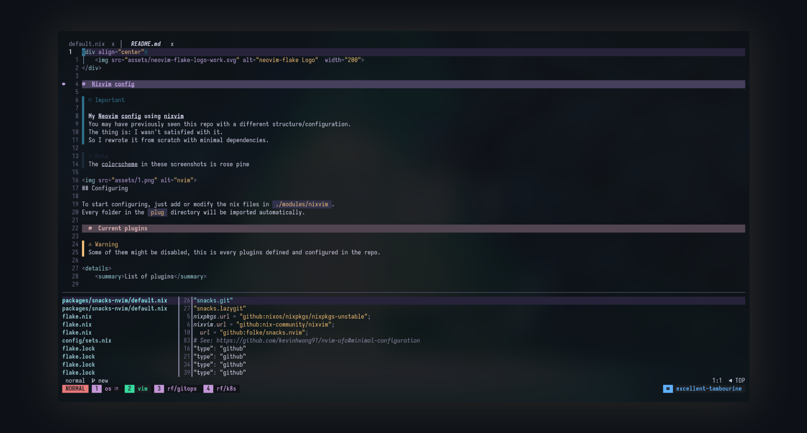

<div align="center">
    
</div>

# Nixvim config

> [!Important]
>
> **My Neovim config using nixvim**
>
> You may have previously seen this repo with a different structure/configuration. \
> The thing is: I wasn't satisfied with it. \
> So I rewrote it from scratch with minimal dependencies. \
> If you want the old configuration, check out the `old` branch.

> [!NOTE]  
> The colorscheme in these screenshots is rose pine



## Configuring

To start configuring, just add or modify the nix files in `./config`.
Every folder in the `plugins` directory will be imported automatically.

### Current plugins

> [!WARNING]
> Some of them might be disabled, this is every plugins defined and configured in the repo.

<details>
    <summary>List of plugins</summary>

- **[avante](../modules/nixvim/plug/avante/default.nix):** Cursor AI at home
- **[copilot-cmp](../modules/nixvim/plug/copilot-cmp/default.nix):** Completion support for GitHub copilot
- **[gitlinker](../modules/nixvim/plug/gitlinker/default.nix):** Generate shareable file permalinks
- **[conform](../modules/nixvim/plug/conform/default.nix):** Formatter plugin
- **[lint](../modules/nixvim/plug/lint/default.nix):** Linting plugin
- **[lsp](../modules/nixvim/plug/lsp/default.nix):** LSP configs
- **[none-ls](../modules/nixvim/plug/none-ls/default.nix):** null-ls replacement. Use nvim as LSP
- **[snacks](../modules/nixvim/plug/snacks)**: A list of utilities
  - Currently using:
    - git
    - indent
    - picker
    - lazygit
    - notifier
- **[treesitter](../modules/nixvim/plug/treesitter/default.nix):** Parser generator tool to build a syntax tree of the current buffer
- **[bufferline](../modules/nixvim/plug/bufferline/default.nix):** VSCode like buffer line
- **[noice](../modules/nixvim/plug/noice/default.nix):** Better nvim UI
- **[mini](../modules/nixvim/plug/mini/default.nix):** Cool neovim utilities
  - currently using
    - ai
    - clue
    - diff
    - files
- **[ufo](../modules/nixvim/plug/ufo/default.nix):** Folding plugin

</details>

## Testing your new configuration

To test your configuration simply run the following command

```
nix run .
```

If you have nix installed, you can directly run my config from anywhere

You can try running mine with:

```shell
nix run 'github:elythh/nixvim'
```

## Installing into NixOS configuration

This `nixvim` flake will output a derivation that you can easily include
in either `home.packages` for `home-manager`, or
`environment.systemPackages` for `NixOS`. Or whatever happens with darwin?

You can add my `nixvim` configuration as an input to your `NixOS` configuration like:

```nix
{
 inputs = {
    nixvim.url = "github:elythh/nixvim";
 };
}
```

### Direct installation

With the input added you can reference it directly.

```nix
{ inputs, system, ... }:
{
  # NixOS
  environment.systemPackages = [ inputs.nixvim.packages.${pkgs.system}.default ];
  # home-manager
  home.packages = [ inputs.nixvim.packages.${pkgs.system}.default ];
}
```

The binary built by `nixvim` is already named as `nvim` so you can call it just
like you normally would.

### Installing as an overlay

Another method is to overlay your custom build over `neovim` from `nixpkgs`.

This method is less straight-forward but allows you to install `neovim` like
you normally would. With this method you would just install `neovim` in your
configuration (`home.packages = with pkgs; [ neovim ]`), but you replace
`neovim` in `pkgs` with your derivation from `nixvim`.

```nix
{
  pkgs = import inputs.nixpkgs {
    overlays = [
      (final: prev: {
        neovim = inputs.nixvim.packages.${pkgs.system}.default;
      })
    ];
  }
}
```

### Bonus lazy method

You can just straight up alias something like `nix run
'github:elythh/nixvim'` to `nvim`.

## Credits

- [yavko](https://github.com/yavko) for the logo
- [nixvim](https://github.com/nix-community/nixvim) and all their maintainers/contributors
