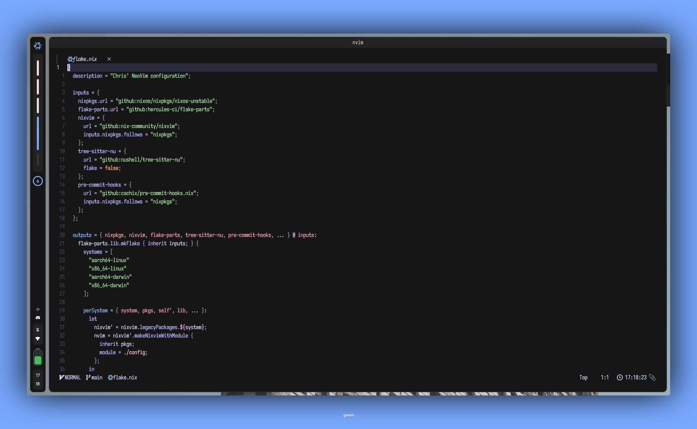
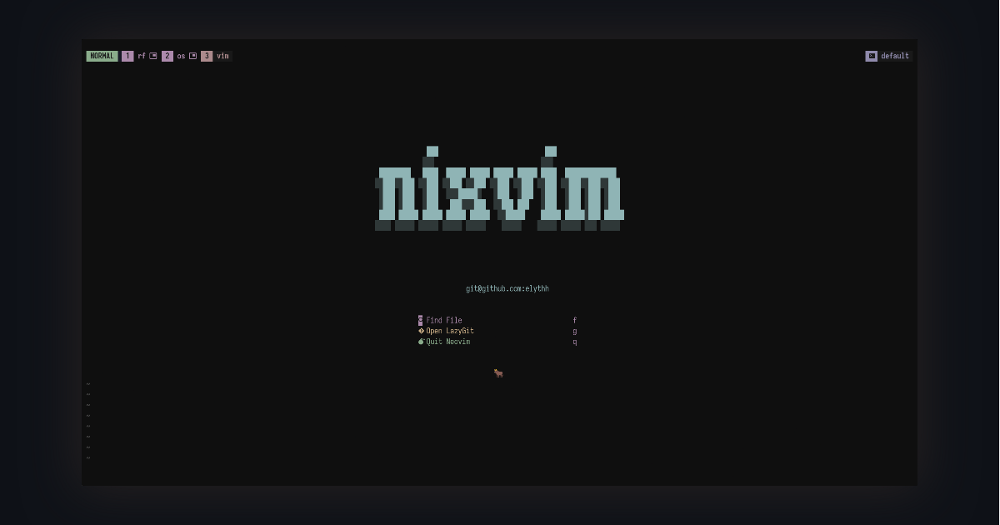
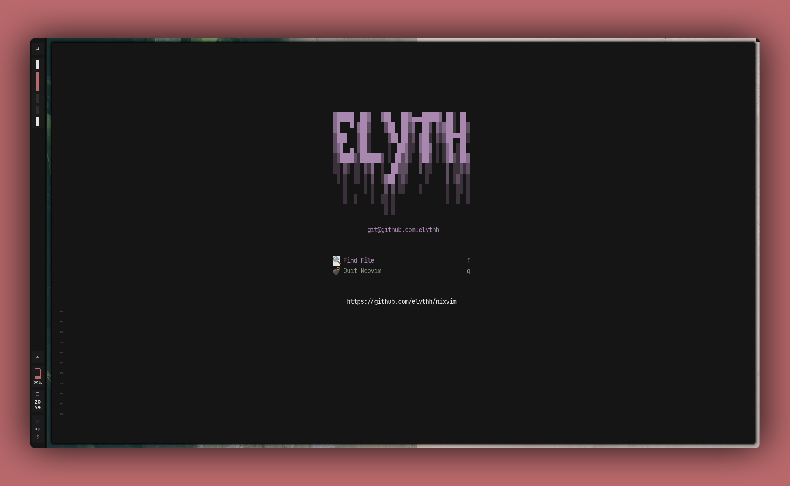
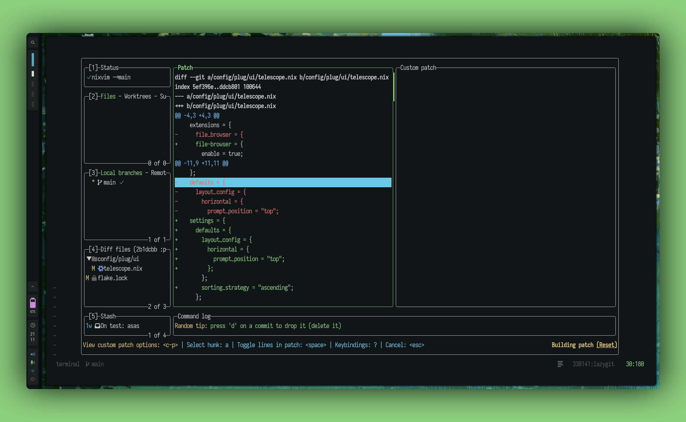

<div align="center">
    
</div>

# Nixvim config

My Neovim config using nixvim.

> [!NOTE]  
> The colorscheme in these screenshots are [paradise](https://github.com/paradise-theme/paradise) and radium



<details>
    <summary>More!</summary>
    
    
    
</details>

## Configuring

To start configuring, just add or modify the nix files in `./modules/nixvim`.
Every folder in the `plug` directory will be imported automatically.

### Current plugins

> [!WARNING]
> Some of them might be disabled, this is every plugins defined and configured in the repo.

<details>
    <summary>List of plugins</summary>

- **[colorscheme/](../modules/nixvim/plug/colorscheme):** Theme configuration. Current one is [paradise](https://github.com/paradise-theme/paradise)
- completion
  - **[avante](../modules/nixvim/plug/avante/default.nix):** Cursor AI at home
  - **[copilot-cmp](../modules/nixvim/plug/copilot-cmp/default.nix):** Completion support for GitHub copilot
  - **[lspkind](../modules/nixvim/plug/lspkind/default.nix):** vscode-like pictograms for neovim lsp completion items
  - **[nvim-cmp](../modules/nixvim/plug/cmp/default.nix):** Completion plugin for nvim + emoji support
  - **[schemastore.nvim](../modules/nixvim/plug/schemastore/default.nix):** Schemastore integration
- git
  - **[gitlinker](../modules/nixvim/plug/gitlinker/default.nix):** Generate shareable file permalinks
  - **[gitblame](../modules/nixvim/plug/gitblame/default.nix):** inline git blame
  - **[gitsigns](../modules/nixvim/plug/gitsigns/default.nix):** Git integration for buffers (replaced by mini.diff + gitblame)
- lsp
  - **[conform](../modules/nixvim/plug/conform/default.nix):** Formatter plugin
  - **[lint](../modules/nixvim/plug/lint/default.nix):** Configure linting using LSP.
  - **[lsp](../modules/nixvim/plug/lsp/default.nix):** LSP configs
  - **[lspsaga](../modules/nixvim/plug/lspsaga/default.nix):** Cool LSP features
  - **[none-ls](../modules/nixvim/plug/none-ls/default.nix):** null-ls replacement. Use nvim as LSP
  - **[trouble](../modules/nixvim/plug/trouble/default.nix):** Pretty interface for working with LSP
- **[snacks](../modules/nixvim/plug/snacks)**
  - set of utilities
- snippet
  - **[luasnip](../modules/nixvim/plug/luasnip/default.nix):** Snippet engine in lua
- statusline
  - **[lualine](../modules/nixvim/plug/lualine/default.nix):** Status line for neovim
- treesitter
  - **[treesitter-context](../modules/nixvim/plug/treesitter-context/default.nix):** Show code context
  - **[treesitter-textobjects](../modules/nixvim/plug/treesitter-textobjects/default.nix):** Allow cool text manipulation thanks to TS
  - **[treesitter](../modules/nixvim/plug/treesitter/default.nix):** Parser generator tool to build a syntax tree of the current buffer
- ui
  - **[bufferline](../modules/nixvim/plug/bufferline/default.nix):** VSCode like line for buffers -> replaced by mini.tabline
  - **[dressing](../modules/nixvim/plug/dressing/default.nix):** Better vim ui interfaces
  - **[fzf-lua](../modules/nixvim/plug/fzf-lua/default.nix):** fzf-lua is my new best friend
  - **[noice](../modules/nixvim/plug/noice/default.nix):** Better nvim UI
  - **[nvim-notify](../modules/nixvim/plug/nvim-notify/default.nix):** Notification manager
  - **[smart-splits](../modules/nixvim/plug/smart-splits/default.nix):** Better split management
  - **[telescope](../modules/nixvim/plug/telescope/default.nix):** Best plugin ever ? Nevermind
- utils
  - **[comment](../modules/nixvim/plug/comment/default.nix):** Quickly toggle comments
  - **[comment-box](../modules/nixvim/plug/comment-box/default.nix):** Comments utilities
  - **[markview](../modules/nixvim/plug/markview/default.nix):** Yet another markdown previewer for neovim
  - **[mini](../modules/nixvim/plug/mini/default.nix):** Cool neovim utilities, currently using ai, notify, surround, diff, tabline, trailspace, icons, indentscope and pairs
  - **[obsidian](../modules/nixvim/plug/obsidian/default.nix):** Obsidian integration for nvim
  - **[spectre](../modules/nixvim/plug/spectre/default.nix):** Search and replace
  - **[typr](../modules/nixvim/plug/typr/default.nix):** Typing practice
  - **[ufo](../modules/nixvim/plug/ufo/default.nix):** Folding plugin
  - **[undotree](../modules/nixvim/plug/undotree/default.nix):** Undo history visualizer

</details>

## Testing your new configuration

To test your configuration simply run the following command

```
nix run .
```

If you have nix installed, you can directly run my config from anywhere

You can try running mine with:

```shell
nix run 'github:elythh/nixvim'
```

## Installing into NixOS configuration

This `nixvim` flake will output a derivation that you can easily include
in either `home.packages` for `home-manager`, or
`environment.systemPackages` for `NixOS`. Or whatever happens with darwin?

You can add my `nixvim` configuration as an input to your `NixOS` configuration like:

```nix
{
 inputs = {
    nixvim.url = "github:elythh/nixvim";
 };
}
```

### Direct installation

With the input added you can reference it directly.

```nix
{ inputs, system, ... }:
{
  # NixOS
  environment.systemPackages = [ inputs.nixvim.packages.${pkgs.system}.default ];
  # home-manager
  home.packages = [ inputs.nixvim.packages.${pkgs.system}.default ];
}
```

The binary built by `nixvim` is already named as `nvim` so you can call it just
like you normally would.

### Installing as an overlay

Another method is to overlay your custom build over `neovim` from `nixpkgs`.

This method is less straight-forward but allows you to install `neovim` like
you normally would. With this method you would just install `neovim` in your
configuration (`home.packages = with pkgs; [ neovim ]`), but you replace
`neovim` in `pkgs` with your derivation from `nixvim`.

```nix
{
  pkgs = import inputs.nixpkgs {
    overlays = [
      (final: prev: {
        neovim = inputs.nixvim.packages.${pkgs.system}.default;
      })
    ];
  }
}
```

### Bonus lazy method

You can just straight up alias something like `nix run
'github:elythh/nixvim'` to `nvim`.

### Bonus extend method

If you want to extend this configuration is your own NixOS config, you can do so using `extend`. See [here](https://nix-community.github.io/nixvim/modules/standalone.html) for more info.

Example for overwriting the theme

```nix
{
  inputs,
  config,
  lib,
  ...
}:
let
  set-custom-theme-module = {
    theme = lib.mkForce "${config.theme}";
    colorschemes.base16 = {
      colorscheme = lib.mkForce {
        inherit (config.lib.stylix.colors.withHashtag)
          base00
          base01
          base02
          base03
          base04
          base05
          base06
          base07
          base08
          base09
          base0A
          base0B
          base0C
          base0D
          base0E
          base0F
          ;
      };
    };
  };
  inherit (inputs.nixvim.nixvimConfigurations."x86_64-linux") nixvim;
  nixvimExtended = nixvim.extendModules {
    modules = [
      set-custom-theme-module
    ];
  };
  elythvim = nixvimExtended.config.build.package;
in
{
  home.packages = [ elythvim ];
}
```

## Credits

- [khaneliman](https://github.com/khaneliman) for repo structure and some plugins configurations
- [yavko](https://github.com/yavko) for the logo
- [nixvim](https://github.com/nix-community/nixvim) and all their maintainers/contributors
